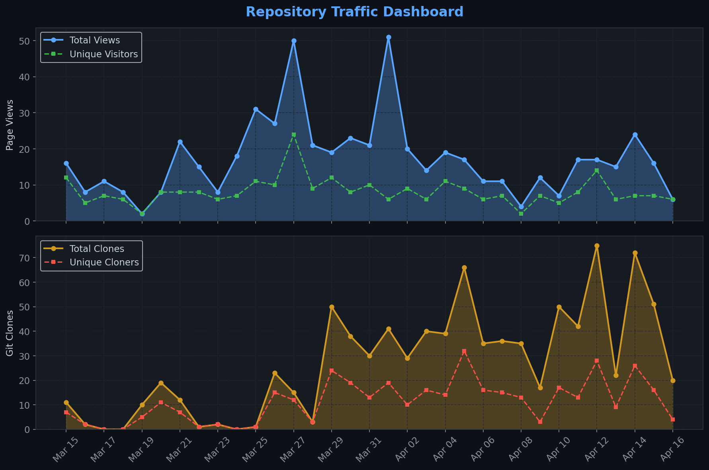
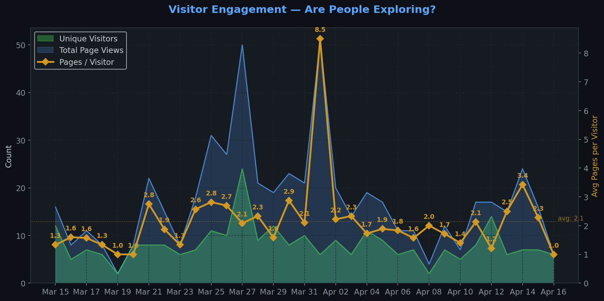
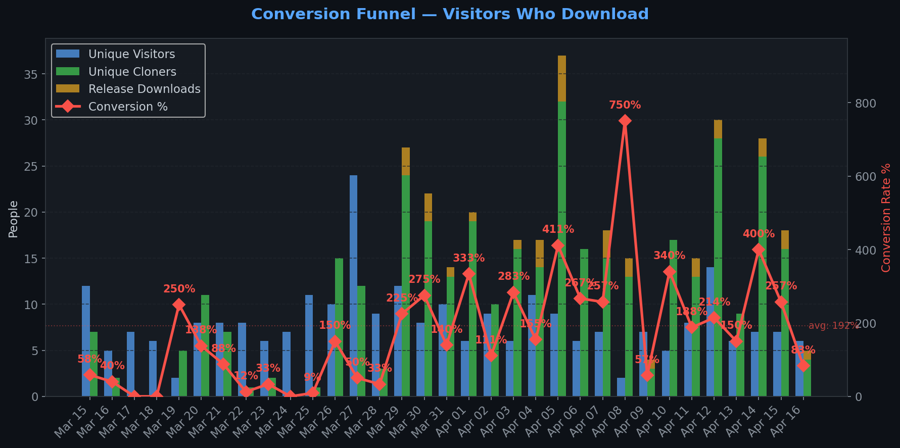
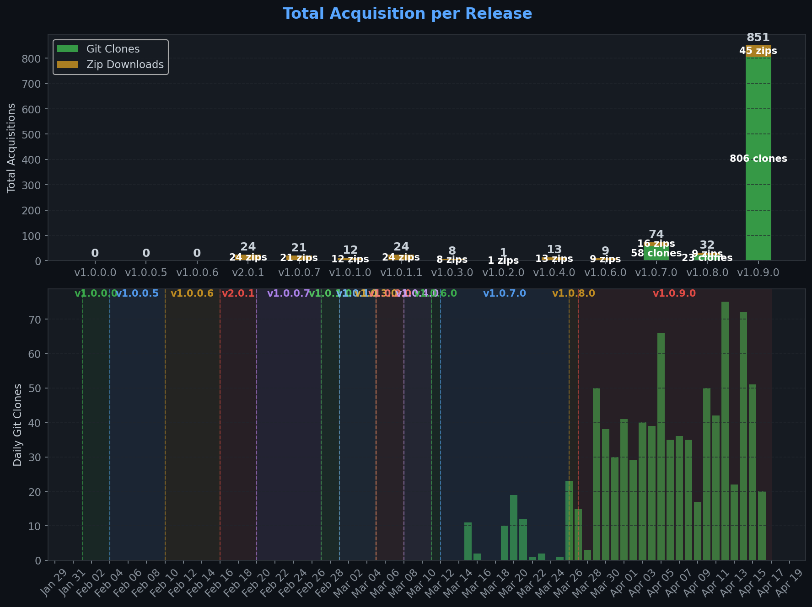
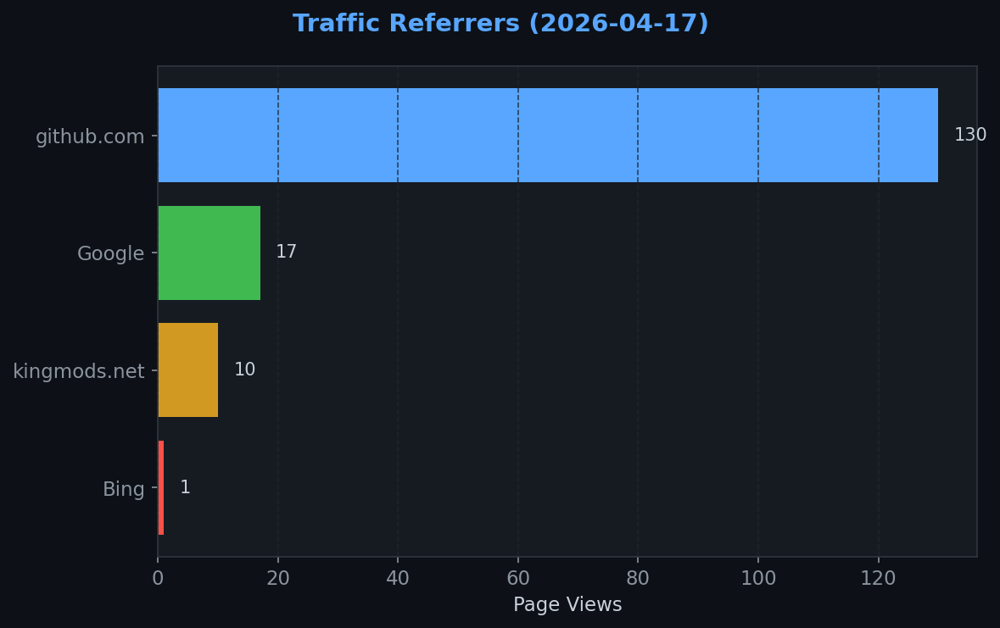
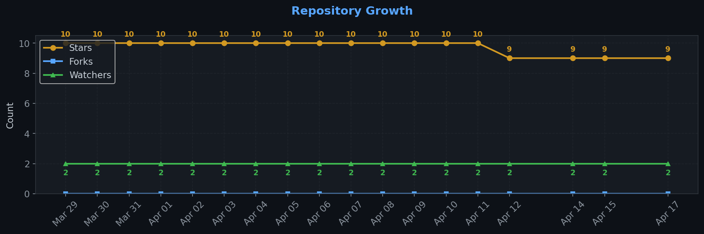

# Repository Traffic Dashboard

**Last updated:** 2026-04-17T06:54:15Z
**Days tracked:** 18 | **Download snapshots:** 71 (hourly)

---

## Views & Clones (14-day window, preserved forever)

| Metric | 14-Day Total | Unique |
|--------|-------------|--------|
| Page Views | 190 | 76 |
| Git Clones | 600 | 177 |

> **Engagement:** 2.5 pages per visitor (14-day avg)

---

## Visitor Engagement

> Higher = visitors exploring more pages. 1.0 = bounce. 3.0+ = deeply engaged.

---

## Conversion Funnel

> **14-day conversion:** 359 of 76 visitors cloned or downloaded (**472.3%**)
>
> Unique cloners: 177 | Release downloads: 182

---

## Total Acquisition per Release (Downloads + Clones)

| Channel | Count |
|---------|-------|
| Zip Downloads | 182 |
| Git Clones (14-day) | 600 |
| **Total Acquisitions** | **782** |

---

## Referrers

| Source | Views | Unique |
|--------|-------|--------|
| github.com | 130 | 41 |
| Google | 17 | 12 |
| kingmods.net | 10 | 8 |
| Bing | 1 | 1 |

---

## Repository Growth

| Metric | Current |
|--------|---------|
| Stars | 9 |
| Forks | 0 |
| Watchers | 2 |

---

## Top Pages (14-day)

| Page | Views | Unique |
|------|-------|--------|
| `/TheCodingDad-TisonK/FS25_WorkerCosts` | 143 | 68 |
| `/TheCodingDad-TisonK/FS25_WorkerCosts/releases/tag/v1.0.9.0` | 23 | 16 |
| `/TheCodingDad-TisonK/FS25_WorkerCosts/releases` | 7 | 5 |
| `/TheCodingDad-TisonK/FS25_WorkerCosts/issues` | 4 | 1 |
| `/TheCodingDad-TisonK/FS25_WorkerCosts/compare/v1.0.9.0...main` | 2 | 2 |
| `/TheCodingDad-TisonK/FS25_WorkerCosts/commits/main` | 2 | 1 |
| `/TheCodingDad-TisonK/FS25_WorkerCosts/releases/tag/v1.0.1.1` | 2 | 1 |
| `/TheCodingDad-TisonK/FS25_WorkerCosts/blob/main/src/gui/WCDashboardFrame.lua` | 1 | 1 |
| `/TheCodingDad-TisonK/FS25_WorkerCosts/commit/08714f078f78e129bbe8137aa1a51ad564d37551` | 1 | 1 |
| `/TheCodingDad-TisonK/FS25_WorkerCosts/issues/24` | 1 | 1 |

---

## Data Files

| File | Description | Granularity |
|------|-------------|-------------|
| [daily.json](daily.json) | Views & clones per day (never expires) | Daily |
| [downloads.json](downloads.json) | Release download snapshots | Hourly |
| [referrers.json](referrers.json) | Referrer snapshots | Daily |
| [metadata.json](metadata.json) | Stars, forks, watchers | Daily |
| [stats.json](stats.json) | Combined legacy snapshots | 6-hourly |

---
*Hourly download tracking + full dashboard with engagement metrics every 6 hours*
*Auto-generated by [traffic-stats.yml](../../.github/workflows/traffic-stats.yml)*
